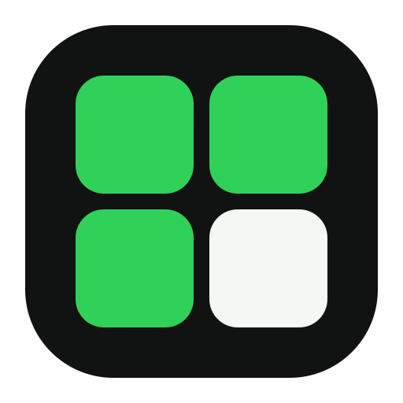
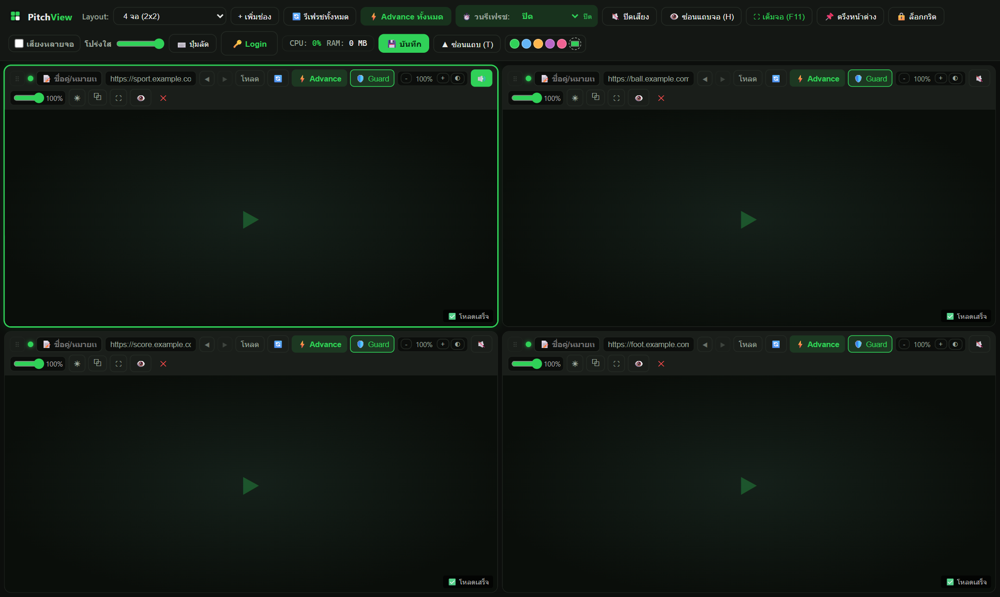
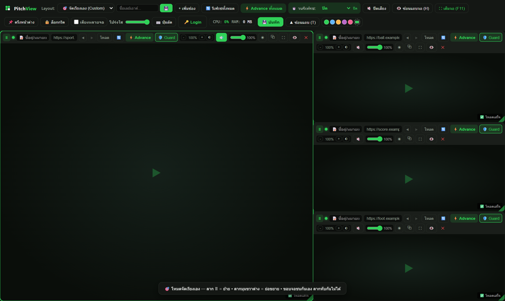

<div align="center">



# 🏟️ PitchView

**ดูฟุตบอลหลายจอพร้อมกันในหน้าต่างเดียว — เรียบ ๆ เร็ว ๆ ใช้งานง่าย**

Multi-view football player for Windows · สร้างด้วย Electron

</div>

---

## ✨ ฟีเจอร์

- 🖥️ **ดูหลายจอพร้อมกัน** — เลย์เอาต์ตาราง 1 / 2 / 4 / 6 / 9 จอ และโหมด Master (1 ใหญ่ + 3 เล็ก)
- 🎯 **จัดเรียงเอง (Custom Layout)** — ลากย้าย/ย่อขยายอิสระ **ขอบจอชนกันแบบแม่เหล็ก ลากทับกันไม่ได้** และบันทึกเป็นเลย์เอาต์พร้อมชื่อได้หลายแบบ (เลือกใช้/ลบได้จากเมนู Layout บนแถบเครื่องมือ)
- 🔒 **Grid Lock + ลากสลับจอ** — ลากจอสลับตำแหน่งในโหมดตาราง โดยวิดีโอ**ไม่สะดุดเลย** (สลับด้วย CSS order)
- ⧉ **Pop-out หน้าต่างแยก** — ดึงจอออกไปวางบนมอนิเตอร์ที่ 2 พร้อมแถบปุ่มควบคุมของตัวเอง (เสียง / รีเฟรช / ตรึงหน้าต่าง) ใช้ session เดียวกัน ไม่ต้องล็อกอินซ้ำ
- 📌 **ตรึงหน้าต่าง (Always on Top)** — ลอยเหนือโปรแกรมอื่นเสมอ เล่นเกม/ทำงานทับได้
- 🔊 **ระบบเสียงครบ** — เปิดเสียงจอเดียวหรือหลายจอพร้อมกัน · เลื่อนล้อเมาส์บนปุ่ม 🔊 ปรับเสียงจอนั้นทันที
- 🌐 **แถบ URL แบบเบราว์เซอร์** — ปุ่มย้อนกลับ/ไปหน้า, ซิงก์ URL ตามหน้าจริง, กด Enter โหลดเลย
- 🟢 **ไฟสถานะต่อจอ (LED)** — เขียว = ปกติ / เหลือง = กำลังโหลด / แดง = พลาด มองแวบเดียวรู้ว่าจอไหนมีปัญหา
- ☀️ **ความสว่าง + โทนนุ่มตาต่อจอ** · 🎨 **ธีมสีเลือกเองได้** (5 สีลัด + จานเลือกสี) · 🫥 **โปร่งใสหน้าต่าง**
- ⏱️ **วนรีเฟรชอัตโนมัติ** — สลับรีเฟรช/Advance ทีละจอ กันเว็บเด้ง session ระหว่างดูทั้งวัน
- ⬆️ **Auto-Update** — เช็คเวอร์ชันใหม่จาก GitHub Releases ดาวน์โหลดเบื้องหลัง แจ้งมุมจอ คลิกเดียวติดตั้ง (เฉพาะตอนติดตั้งด้วยตัวติดตั้ง NSIS)

## ⌨️ ปุ่มลัด

| ปุ่ม | หน้าที่ |
|---|---|
| `1 – 9` | เปิด/สลับเสียงจอที่ 1–9 |
| `Shift + 1 – 9` | ขยายเดี่ยวจอนั้นเต็มหน้าจอ |
| `Tab` / `← →` | วนเสียงไปจอถัดไป / ย้อนกลับ |
| `M` | ปิดเสียงทุกจอทันที |
| `H` | ซ่อน/โชว์แถบหัวจอทุกจอ |
| `T` | ซ่อน/โชว์แถบเครื่องมือบน |
| `F11` | เต็มจอ |
| `?` | เปิดสมุดปุ่มลัดในแอป |
| `Esc` | ย่อจอที่ขยาย / ดึงทุก pop-out กลับ |
| `Ctrl + P` (ในหน้าต่าง pop-out) | ตรึงหน้าต่างแยก |
| `Enter` (ช่องชื่อเลย์เอาต์) | บันทึกเลย์เอาต์ Custom |

## 📸 ภาพหน้าจอ

> 🚧 ยังไม่ได้แนบภาพ — วิธีเพิ่ม: จับหน้าจอแอปบันทึกไว้ที่ `docs/screenshots/` ตามชื่อไฟล์ด้านล่าง แล้วเอา comment ออกในบล็อกตัวอย่าง ภาพจะขึ้นบนหน้า GitHub ทันที

ภาพที่แนะนำ:

| ภาพ | บันทึกไว้ที่ |
|---|---|
| หน้าจอหลักแบบ 4 จอ | `docs/screenshots/main-grid.png` |
| โหมดจัดเรียงเอง (ลากจอ ขอบชนกันแบบแม่เหล็ก) | `docs/screenshots/custom-layout.png` |
| หน้าต่าง pop-out บนมอนิเตอร์ที่สอง | `docs/screenshots/popout.png` |

<!-- ตัวอย่างมาร์กอัป — เอา comment ออกหลังใส่ไฟล์ภาพแล้ว
|  |  |  |
|:---:|:---:|:---:|
| หน้าจอหลัก (4 จอ) | จัดเรียงเอง | Pop-out ไปจอที่สอง |
-->

## 📥 ดาวน์โหลด / ติดตั้ง

1. ไปที่หน้า **[Releases](https://github.com/WhyAlwaysEng/PitchView/releases)** แล้วดาวน์โหลด `PitchView Setup x.x.x.exe`
2. ดับเบิลคลิกติดตั้ง — ได้ shortcut บน Desktop และ Start Menu อัตโนมัติ
3. ถ้า Windows SmartScreen แจ้งเตือน (แอปไม่ได้เซ็นใบรับรอง) กด **More info → Run anyway**
4. เวอร์ชันถัด ๆ ไป: แอปจะแจ้งอัปเดตเองมุมขวาล่าง คลิกเดียวติดตั้งจบ

## 🚀 เริ่มใช้งาน

1. วางลิงก์สตรีมในช่องของแต่ละจอ → กดโหลด (หรือ `Enter`)
2. เลือกเลย์เอาต์จากเมนู หรือเลือก **🎯 จัดเรียงเอง** ลากจอเองแล้วตั้งชื่อบันทึกไว้ใช้รอบหน้า
3. ถ้าเว็บให้ล็อกอิน กดปุ่มเข้าสู่ระบบของจอนั้น — ทุกจอใช้ session/cookie เดียวกัน ล็อกอิน**ครั้งเดียวจบ**

## 🛠️ Build จากซอร์ส

```bash
npm install
npm start        # รันแบบ dev
npm run dist     # build ตัวติดตั้ง NSIS ลงโฟลเดอร์ dist/
```

**โครงสร้างโปรเจกต์**

| ไฟล์ | หน้าที่ |
|---|---|
| `main.js` | Electron main process (หน้าต่าง, session/UA, pop-out, auto-update) |
| `index.html` + `app.js` + `style.css` | หน้าจอหลักทั้งหมด (เลย์เอาต์, ลากจอ, เสียง, ปุ่มลัด) |
| `popout.html` | หน้าควบคุมของหน้าต่าง pop-out |
| `assets/` | โลโก้ (icon.svg/png/ico — สร้างด้วย `scripts/make-icon.js`) |
| `code-viewer.html` | เครื่องมือดูซอร์สโค้ดพร้อม syntax highlighter (ไม่ใช้ dependency) |
| `test/` | ชุดทดสอบ interactive (`test/harness.html` — เปิดผ่าน local server) |

## 🔄 ปล่อยเวอร์ชันใหม่ (Release)

1. เพิ่มเลขเวอร์ชันใน `package.json`
2. `npm run dist` → ได้ตัวติดตั้งใน `dist/`
3. สร้าง Release บน GitHub แล้วแนบไฟล์ใน `dist/` (`PitchView Setup x.x.x.exe`, `.blockmap`, `latest.yml`) — หรือใช้ `npm run dist -- --publish always` ให้ electron-builder อัปโหลดเอง (ต้องมี `GH_TOKEN`)
4. แอปของผู้ใช้เดิมจะเช็คเจอเวอร์ชันใหม่เอง → ดาวน์โหลดเบื้องหลัง → กดติดตั้ง

## 📝 หมายเหตุเทคนิค

- Session/cookie เก็บใน partition `persist:dooball_session` — **อย่าเปลี่ยนชื่อ** ไม่งั้น login ที่บันทึกไว้จะหายทั้งหมด
- User-Agent ของทุก webview ถูกตั้งให้ตรงกับ Chromium จริงของ Electron (รวม Client Hints) เพื่อไม่ให้ระบบ anti-bot ของเว็บสตรีมตัด session กลางคัน
- อายุ session บางเว็บกำหนดจากฝั่งเซิร์ฟเวอร์เอง (เช่น ให้ล็อกอินใหม่ทุก 24 ชม.) — ตามรอบของเว็บนั้นตามปกติ

## 📄 License

[MIT](LICENSE)
